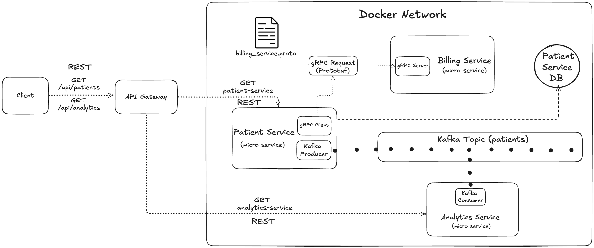

# Patient Management Microservices Project

[](http://170.9.50.175:4004/)

## Overview

This project demonstrates a simple microservices architecture using Java and Spring Boot, integrated with Kafka and PostgreSQL. It is designed primarily as a learning and exploration project to understand how microservices are built, deployed, and interact with each other in a distributed environment.

The system consists of the following microservices:

- **API Gateway**: Routes external HTTP requests to appropriate microservices and serves as the entry point for the backend.
- **Patient Service**: Manages patient data and persistence with PostgreSQL.
- **Billing Service**: Handles billing-related functionality, exposing both REST and gRPC endpoints.
- **Analytics Service**: Consumes `Kafka` topics to perform analytics or logging (Kafka consumer).
  
`Kafka` is used as the messaging backbone for asynchronous communication between services, and PostgreSQL serves as the primary relational database for patient data.

All services are containerized using Docker, orchestrated locally via Docker Compose.

---

## System Architecture



## Technologies Used

- Java 21
- Spring Boot (Web, Cloud Gateway, Kafka)
- Apache Kafka (Bitnami Kafka Docker image)
- PostgreSQL (official Docker image)
- Docker & Docker Compose
- gRPC (for billing service)

---


## Project Structure

```
patient-management/
├── api-gateway/         # Spring Boot API Gateway service
├── patient-service/     # Spring Boot patient management service
├── billing-service/     # Spring Boot billing service with REST and gRPC
├── analytics-service/   # Kafka consumer service for analytics
├── docker-compose.yml   # Docker Compose file to run all services together
└── README.md            # Project documentation
```
---

## Key Features

- Microservices architecture with clear service boundaries
- API Gateway for request routing and API documentation
- Asynchronous communication using Kafka topics
- Persistent data storage with PostgreSQL and schema initialization via SQL scripts
- Containerized services with Dockerfiles per service for easy deployment
- Local orchestration using Docker Compose
- Designed for deployment on cloud VMs (e.g., Oracle Cloud free tier ARM instance)

---

## How to Run Locally

1. Clone the repository:

```bash
git clone https://github.com/shashankhs11/patient-management.git
cd patient-management
```

2. Make sure Docker and Docker Compose are installed.

3. Run all services:
```bash
docker compose up --build
```

4. Access the API Gateway at `http://localhost:4004`.


## Deployment

- Services can be deployed on cloud virtual machines.
- Expose API Gateway port `4004` to public internet to enable frontend connectivity.
- Use Docker Compose on the VM for running all containers together.
- CI/CD pipelines (e.g., GitHub Actions) can be configured for automated deployment.
